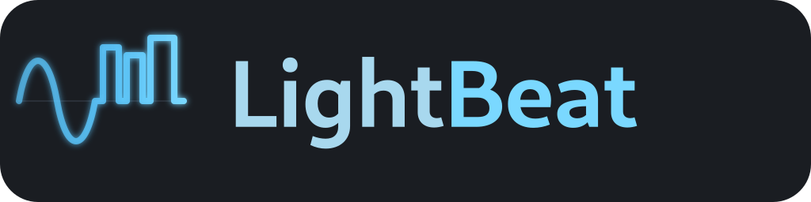

  

  Beat-driven lighting control for clubs and live music. 
  Node-graph based, written in Rust.

---

LightBeat is a tool to control DMX lights based on the **structure of the music**
(beats, phrases, energy) rather than the timeline of a cue list. The traditional
lighting world has its roots in theatre, where every cue is hand-fired against
a script. That doesn't fit a club where the dancefloor is the script — so this
is a clean-slate take aimed at venues, not stages.

Under the hood it's a node graph: tempo and audio sources flow into pattern,
gradient, palette, and trigger nodes, then out to ArtNet/sACN universes. Every
node runs on a real-time engine; the UI is decoupled and never blocks the
output thread.

## Assets

`assets/` contains:

- `logo.svg` — the square icon source (continuous sine morphing into discrete
  beat pulses, on a dark gray rounded square).
- `wordmark.svg` — horizontal variant with the "LightBeat" wordmark next to
  the symbol. Use this for README headers, docs banners, and social cards.
- `icon-{16,32,48,64,128,256,512,1024}.png` — pre-rendered square icons.
  Smaller sizes for favicons / window icons, larger ones for app packaging.
- `wordmark-{256,512,1024,2048}.png` — pre-rendered banners (4:1).
